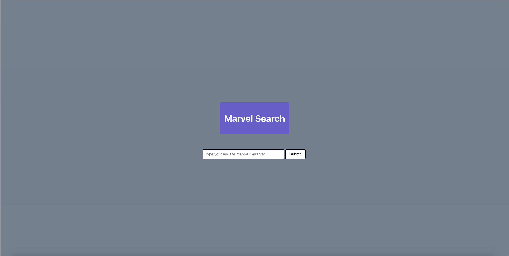

# This That front end

## Description

Simple front end targeting the Marvel api and extracting the names of characters to populate an input search bar. 

## Mock-Up

The following picture shows an example of the application being used:




## Installation

Ensure that you have Node.js installed on your system then modifying the .env variables. Register for a Marvel API key and utilise the provided public API key. Remember to include '*' as a referral since you will be accessing the endpoint from localhost.

```bash
npm install 
npm run start
```

###

Written by Christian Alteri

To learn more about other projects, [click here](https://github.com/ChristianAlteri/marvel-frontend).

####

[](LICENSE)